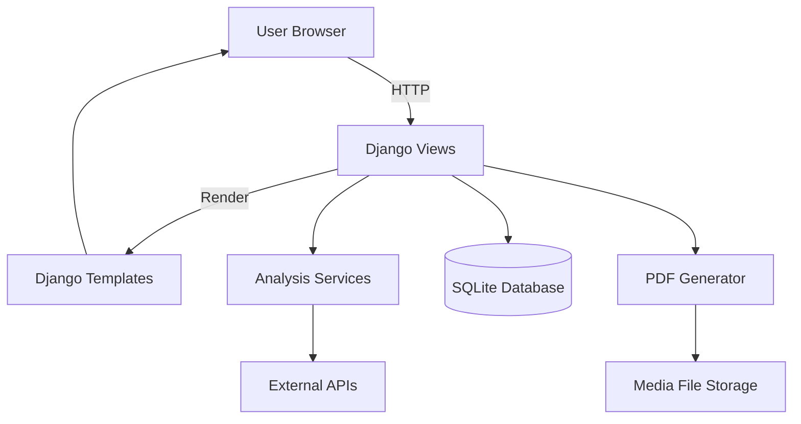

# SEO Optima Viva Prep Pack - Overall Project Documentation

## 1. Project Aim and Problem It Solves
**Aim:** Build a beginner-friendly SEO auditing dashboard that analyzes a website using multiple SEO lenses (performance, content structure, images/alt text, and keyword visibility), stores results, and generates PDF reports.

**Problem it solves:**
- Many small website owners do not know why their SEO performance is weak.
- Existing SEO tools are often complex, expensive, or fragmented.
- SEO Optima combines key analysis types in one Django app with simple explanations and downloadable reports.

## 2. Overall System Architecture (High-Level)
- **Frontend:** Django templates with Bootstrap, Chart.js, and custom CSS for UI.
- **Backend:** Django views + services for analysis logic.
- **Database:** SQLite stores users and all analysis records.
- **External APIs:** Google PageSpeed Insights API and Google Search Console API.
- **Reporting:** ReportLab for PDF generation.

### Architecture Diagram


## 3. Django Project Structure (What Each App Does)
- **config/**: Django settings, URL routing, WSGI/ASGI.
- **core/**: Simple redirect to dashboard home.
- **accounts/**: Registration, login, OTP verification, user profile, settings.
- **dashboard/**: All SEO features, analytics, and reports.
- **templates/**: HTML UI for accounts and dashboard.
- **static/** and **staticfiles/**: CSS/JS assets.
- **media/**: Uploaded files (profile photos, PDF reports).

## 4. MVT (Model-View-Template) Flow in This Project
**Typical flow for any feature:**
1. **URL** maps to a **View** (function/class in `dashboard/views.py` or `accounts/views.py`).
2. The view validates a **Form** or request data.
3. The view calls a **Service** (example: `pagespeed.py`) to do heavy work.
4. The view saves data into **Models** (example: `PageSpeedAnalysis`).
5. The view renders a **Template** and passes context data.

**Example (PageSpeed):**
- URL: `/dashboard/page-speed-insights/`
- View: `page_speed_insights`
- Model: `PageSpeedAnalysis`
- Template: `templates/dashboard/page_speed_insights.html`
- Service: `dashboard/services/pagespeed.py`

## 5. Database Design and Models (Core Tables)
**accounts.UserProfile**
- One-to-one with Django `User`
- Stores profile photo, social links, defaults, preferences

**accounts.OTP**
- Stores OTP code, expiration, and verification status

**dashboard.PageSpeedAnalysis**
- URL, device strategy, scores, metrics, raw response

**dashboard.HeaderAnalysis**
- URL, header counts, headers list

**dashboard.ImageAltAnalysis**
- URL, counts, image list and alt text status

**dashboard.KeywordAnalysis**
- URL, keyword stats, list of keywords and ranking data

**dashboard.GSCConnection**
- OAuth credentials, properties list, active state

**dashboard.PDFReport**
- Report metadata, related analyses, PDF file path

## 6. Main URL and Request Flow
**Entry point:**
- `/` in `core` redirects to dashboard home.

**Authentication:**
- `/accounts/register/`, `/accounts/login/`, `/accounts/verify-otp/`.

**Dashboard features (high-level):**
- `/dashboard/page-speed-insights/`
- `/dashboard/extract-headers/`
- `/dashboard/image-alt-finder/`
- `/dashboard/keywords-finder/`
- `/dashboard/reports/`

## 7. External APIs Used
- **Google PageSpeed Insights API**
  - Fetches performance metrics (LCP, CLS, INP, etc.)
  - Called in `dashboard/services/pagespeed.py`

- **Google Search Console API**
  - Fetches real keywords and ranking data
  - OAuth handled in `dashboard/views.py`
  - Data fetched in `dashboard/services/keyword_extractor.py`

- **Google OAuth (Login + GSC)**
  - User sign-in with Google (accounts)
  - GSC OAuth for Search Console (dashboard)

- **Gmail SMTP (Email OTP)**
  - Used to send OTP verification emails

## 8. Data Flow: User Input to Database to Dashboard
**Example (Image Alt Analysis):**
1. User enters a URL on the form.
2. View validates the URL and calls `extract_images`.
3. Service fetches HTML and extracts image tags with alt text.
4. View stores results in `ImageAltAnalysis`.
5. Dashboard template displays results.

## 9. Technologies Used and Why
- **Django**: Fast development, built-in auth, ORM, templates.
- **SQLite**: Simple local database for FYP.
- **Requests**: Simple HTTP calls to fetch page HTML and APIs.
- **BeautifulSoup (bs4)**: Parse HTML for headers and images.
- **Google APIs**: Real SEO data from Google sources.
- **ReportLab**: Structured PDF generation.
- **Bootstrap + Chart.js**: UI and charts.

## 10. Testing Approach
- Django tests for dashboard and accounts are in `accounts/tests.py` and `dashboard/tests.py`.
- Additional local scripts:
  - `test_email.py` tests SMTP email sending.
  - `test_property_matching.py` validates GSC property matching logic.

## 11. Limitations and Future Improvements
**Current limitations:**
- Uses SQLite and DEBUG enabled (not production-ready).
- No background task queue; long API calls run in request cycle.
- Rate limits not handled globally.
- Some dependencies like `bs4` are used but not pinned in requirements.
- PDF regeneration is marked TODO.

**Future improvements:**
- Use Postgres + Redis + Celery for scalable processing.
- Add caching and analysis scheduling.
- Add more SEO modules (backlinks, sitemap checks).
- Full role-based admin controls.

## 12. How to Explain the Project in a Viva
**Short pitch (1 minute):**
"SEO Optima is a Django web platform that helps users audit a website using multiple SEO dimensions. It combines performance testing from Google PageSpeed, real keyword data from Google Search Console, and on-page checks like heading structure and image alt text. Results are stored in a database and can be compiled into a PDF report. The project focuses on helping non-experts understand SEO in a single, beginner-friendly dashboard."

**Key points to stress:**
- Real data from Google APIs.
- Each feature stores results in the database for history.
- MVT separation: views + services + templates.
- Designed for clarity and learning, not just raw data.

## 13. Short Code Snippet (With Line-by-Line Explanation)
### OTP creation (accounts/models.py)
```python
@classmethod
def create_otp(cls, user):
    code = cls.generate_code()
    expires_at = timezone.now() + timedelta(minutes=10)
    return cls.objects.create(user=user, code=code, expires_at=expires_at)
```
**Line-by-line:**
- `@classmethod`: allows calling on the model class.
- `generate_code()`: makes a 6-digit OTP.
- `expires_at`: sets validity to 10 minutes.
- `objects.create(...)`: stores OTP in the database.

### PageSpeed fetch (dashboard/services/pagespeed.py)
```python
response = requests.get(PAGESPEED_API, params=params, timeout=60)
response.raise_for_status()
data = response.json()
return parse_pagespeed_response(data)
```
**Line-by-line:**
- `requests.get(...)`: calls the Google API.
- `raise_for_status()`: throws error if request failed.
- `response.json()`: converts response to Python dict.
- `parse_pagespeed_response(...)`: extracts clean metrics.
